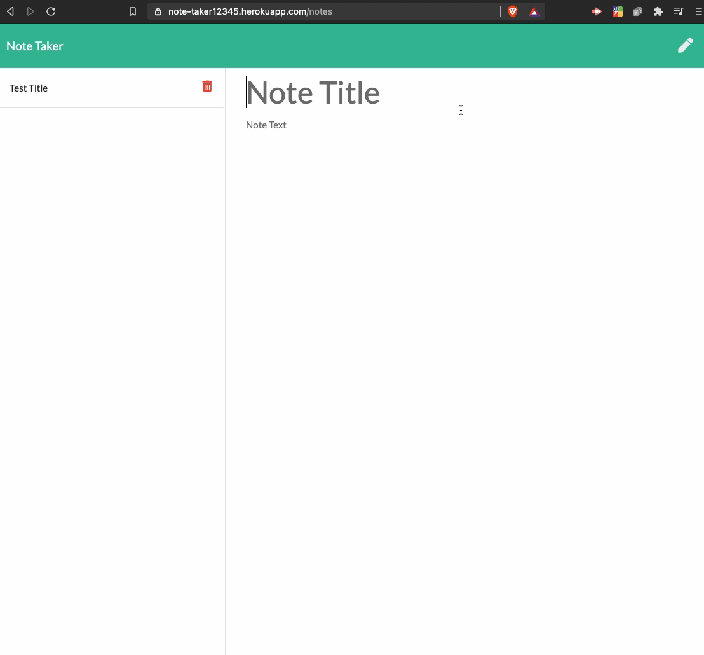
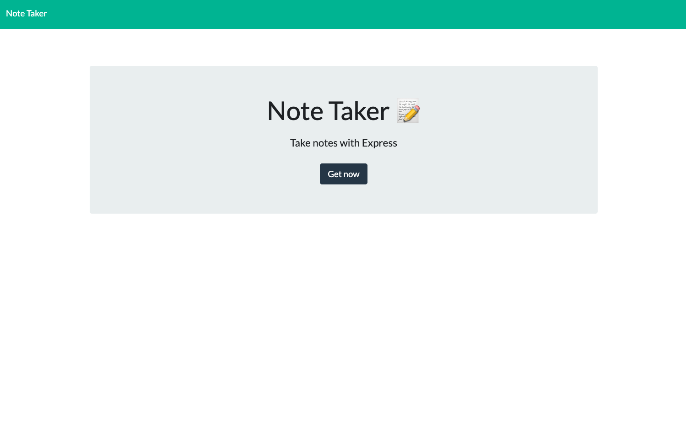
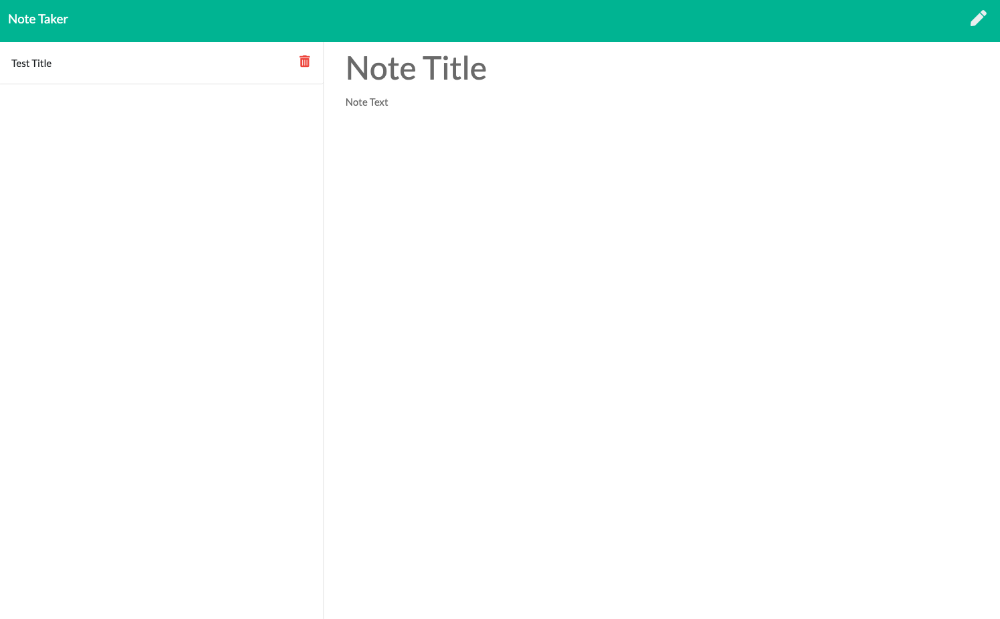

# Note-Taker

## Description

This application helps you take notes.

## Table of Contents

* [Links](#Links)
* [Demo](#Demo)
* [Language](#Language)
* [Installation](#Installation)
* [License](#License)

## Links

* Project Repo: [Repository](https://github.com/jonesliddy77/Note-Taker)
* Heroku Deplaoyed Website: [Website](https://note-taker12345.herokuapp.com/)

## Demo



## Screenshots



## Language

* JavaScript
* HTML
* CSS

## Installation

Install Node Modules folder
```
npm i
```

## License

MIT © [Jones Liddy](https://github.com/jonesliddy77)
